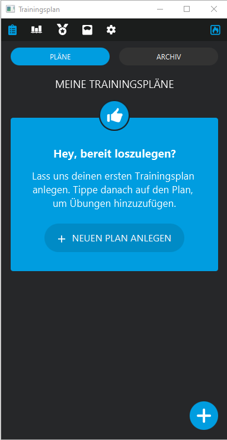

# Fitness Plan

Der **Fitness Plan** ist eine Anwendung, mit der du deine Trainingsroutinen, Übungseinheiten und Wiederholungen einfach verwalten und organisieren kannst.

## Informationen
Dieses Projekt stellt meine Java-Projektarbeit dar, die im Rahmen eines fünftägigen Projekts erstellt wurde.

## Screenshots


## Systemanforderungen 🔧
Um diese Anwendung auszuführen, benötigst du mindestens JDK 20 oder eine neuere Version.

## Installation 🔌
Folge diesen Schritten, um die Anwendung auf deinem lokalen System zu installieren:

1. Lade die Repository-Daten herunter, indem du folgenden Befehl ausführst:
   ```shell
   git clone https://github.com/mikework24/Trainingsplan.git
   ```

2. Starte einen lokalen MySQL-Server und importiere die Datei "fitnessplan.sql".

3. Öffne das Projekt in IntelliJ IDEA oder einem anderen geeigneten Entwicklungsumfeld.

4. Starte die Anwendung.